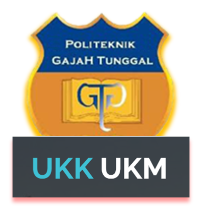

[![Contributors][contributors-shield]][contributors-url]
[![Forks][forks-shield]][forks-url]
[![Stargazers][stars-shield]][stars-url]
[![Issues][issues-shield]][issues-url]
[![MIT License][license-shield]][license-url]
[![LinkedIn][linkedin-shield]][linkedin-url]


<!-- PROJECT LOGO -->
<br />
<div align="center">
  <a href="https://github.com/mardi12345/ukkukmpoltek">
    
  </a>

  <h3 align="center">Pusat UKK UKM <br> Politeknik Gajah Tunggal </h3>

  <p align="center">
    Project Pemrograman Webiste
    <br>
  </p>
</div>


<!-- TABLE OF CONTENTS -->
<details>
  <summary>Table of Contents</summary>
  <ol>
    <li>
      <a href="#about-the-project">About The Project</a>
      <ul>
        <li><a href="#built-with">Built With</a></li>
      </ul>
    </li>
    <li>
      <a href="#getting-started">Getting Started</a>
      <ul>
        <li><a href="#installation">Installation</a></li>
      </ul>
    </li>
    <li><a href="#contributing">Contributing</a></li>
    <li><a href="#license">License</a></li>
    <li><a href="#acknowledgments">Acknowledgments</a></li>
  </ol>
</details>


<!-- ABOUT THE PROJECT -->
## About The Project
<b> Homepage </b>
[![Product Name Screen Shot][product-screenshot]]
<b> Log Page </b>
[![Product Name Screen Shot][product-screenshot2]]
[![Product Name Screen Shot][product-screenshot3]]
<b> Dash Page Ketua </b>
[![Product Name Screen Shot][product-screenshot4]]

Ini Adalah Sebuah Project Website bagi UKK/UKM/Organisasi Poltek GT yang diharapkan dapat berfungsi sebagai :
- Sistem Informasi / Forum Bagi UKK UKM Poltek GT
- Pengelolaan Keanggotaan / Anggota yang lebih mudah
- Pendaftaran UKK UKM Secara Online dan Simple

This is a website project for UKK/UKM/GT Polytechnic organizations which is expected to function as:
- Information System / Forum for UKK UKM Poltek GT
- Easier Membership / Member Management
- Online and Simple UKK UKM Registration

<p align="right">(<a href="#readme-top">back to top</a>)</p>


### Built With

Below are some of the frameworks used to build this website : <br>
Web ini dibuat dengan beberapa Framework dibawah:

* [![Next][Next.js]][Next-url]
* [![React][React.js]][React-url]
* [![Vue][Vue.js]][Vue-url]
* [![Angular][Angular.io]][Angular-url]
* [![Laravel][Laravel.com]][Laravel-url]
* [![Bootstrap][Bootstrap.com]][Bootstrap-url]
* [![JQuery][JQuery.com]][JQuery-url]

<p align="right">(<a href="#readme-top">back to top</a>)</p>


<!-- GETTING STARTED -->
## Getting Started

Below are simple instructions for building this website together in your codespace. <br> 
Di bawah ini adalah petunjuk sederhana untuk membangun situs web ini bersama-sama di ruang kode Anda.

### Installation

Clone this repo in your codespaces

1. Clone the repo
   ```sh
   git clone https://github.com/mardi12345/ukkukmpoltek.git
   ```

<p align="right">(<a href="#readme-top">back to top</a>)</p>

<!-- CONTRIBUTING -->
## Contributing

Kontribusi inilah yang membuat komunitas open source menjadi tempat yang luar biasa untuk belajar, menginspirasi, dan berkreasi. Setiap kontribusi yang Anda berikan **sangat dihargai**.

Jika Anda memiliki saran yang dapat membuat ini lebih baik, harap fork repo dan buat permintaan tarik. Anda juga dapat membuka masalah dengan tag "peningkatan".
Jangan lupa untuk memberi proyek ini bintang! Terima kasih lagi!

1. Fork Proyek
2. Buat Cabang Fitur Anda (`git checkout -b feature/AmazingFeature`)
3. Komit Perubahan Anda (`git commit -m 'Tambahkan beberapa Fitur Luar Biasa'`)
4. Dorong ke branch (`fitur asal git push/AmazingFeature`)
5. Buka Permintaan pull

---------------------------------------------------
Contributions are what make the open source community such an amazing place to learn, inspire, and create. Any contributions you make are **greatly appreciated**.

If you have a suggestion that would make this better, please fork the repo and create a pull request. You can also simply open an issue with the tag "enhancement".
Don't forget to give the project a star! Thanks again!

1. Fork the Project
2. Create your Feature Branch (`git checkout -b feature/AmazingFeature`)
3. Commit your Changes (`git commit -m 'Add some AmazingFeature'`)
4. Push to the Branch (`git push origin feature/AmazingFeature`)
5. Open a Pull Request

<p align="right">(<a href="#readme-top">back to top</a>)</p>


<!-- LICENSE -->
## License

Distributed under the MIT License. See `LICENSE.txt` for more information.

<p align="right">(<a href="#readme-top">back to top</a>)</p>

<!-- ACKNOWLEDGMENTS -->
## Acknowledgments

Use this space to list resources you find helpful and would like to give credit to. I've included a few of my favorites to kick things off! <br>

Gunakan ruang ini untuk membuat daftar sumber daya yang menurut Anda bermanfaat dan ingin Anda berikan penghargaannya. Saya telah menyertakan beberapa favorit saya untuk memulai!

* [Choose an Open Source License](https://choosealicense.com)
* [GitHub Emoji Cheat Sheet](https://www.webpagefx.com/tools/emoji-cheat-sheet)
* [Malven's Flexbox Cheatsheet](https://flexbox.malven.co/)
* [Malven's Grid Cheatsheet](https://grid.malven.co/)
* [Img Shields](https://shields.io)
* [GitHub Pages](https://pages.github.com)
* [Font Awesome](https://fontawesome.com)
* [React Icons](https://react-icons.github.io/react-icons/search)

<p align="right">(<a href="#readme-top">back to top</a>)</p>


<!-- MARKDOWN LINKS & IMAGES -->
<!-- https://www.markdownguide.org/basic-syntax/#reference-style-links -->
[contributors-shield]: https://img.shields.io/github/contributors/mardi12345/ukkukmpoltek.svg?style=for-the-badge
[contributors-url]: https://github.com/mardi12345/ukkukmpoltek/graphs/contributors
[forks-shield]: https://img.shields.io/github/forks/mardi12345/ukkukmpoltek.svg?style=for-the-badge
[forks-url]: https://github.com/mardi12345/ukkukmpoltek/forks
[stars-shield]: https://img.shields.io/github/stars/mardi12345/ukkukmpoltek.svg?style=for-the-badge
[stars-url]: https://github.com/mardi12345/ukkukmpoltek/stargazers
[issues-shield]: https://img.shields.io/github/issues/mardi12345/ukkukmpoltek.svg?style=for-the-badge
[issues-url]: https://github.com/mardi12345/ukkukmpoltek/issues
[license-shield]: https://img.shields.io/github/license/mardi12345/ukkukmpoltek.svg?style=for-the-badge
[license-url]: https://github.com/mardi12345/ukkukmpoltek/blob/main/LICENSE
[linkedin-shield]: https://img.shields.io/badge/-LinkedIn-black.svg?style=for-the-badge&logo=linkedin&colorB=555
[linkedin-url]: https://www.linkedin.com/in/m-ardi-nugroho-findme/
[product-screenshot]: homepage.png
[product-screenshot2]: mahasiswa.png
[product-screenshot3]: ketua.png
[product-screenshot4]: dash.png
[Next.js]: https://img.shields.io/badge/MySQL-00000F?style=for-the-badge&logo=mysql&logoColor=white
[Next-url]: https://mysql.com
[React.js]: https://img.shields.io/badge/PHP-777BB4?style=for-the-badge&logo=php&logoColor=white
[React-url]: https://php.net
[Vue.js]: https://img.shields.io/badge/HTML-239120?style=for-the-badge&logo=html5&logoColor=white
[Vue-url]: https://html.com
[Angular.io]: https://img.shields.io/badge/CSS-239120?&style=for-the-badge&logo=css3&logoColor=white
[Angular-url]: https://css-com.com
[Laravel.com]: https://img.shields.io/badge/CodeIgniter-%23EF4223.svg?style=for-the-badge&logo=codeIgniter&logoColor=white
[Laravel-url]: https://codeigniter.com
[Bootstrap.com]: https://img.shields.io/badge/Bootstrap-563D7C?style=for-the-badge&logo=bootstrap&logoColor=white
[Bootstrap-url]: https://getbootstrap.com
[JQuery.com]: https://shields.io/badge/JavaScript-F7DF1E?logo=JavaScript&logoColor=000&style=flat-square
[JQuery-url]: https://javascript.com 
